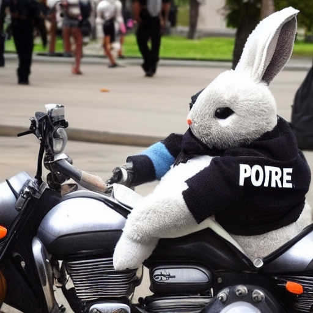
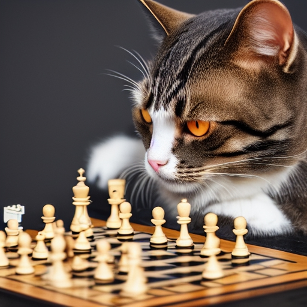

# Generate images from text with diffusion models  
I simplified the original first part of this [keras example](https://keras.io/examples/generative/random_walks_with_stable_diffusion/) to generate images almost without coding.  
The simple steps are in [this notebook](https://github.com/bsaldivaremc2/diffusion-model-scripts/blob/main/generate-diffusion-images/generate_images_interactively.ipynb) or use it as well in [google colab](https://githubtocolab.com/bsaldivaremc2/diffusion-model-scripts/blob/main/generate-diffusion-images/generate_images_interactively.ipynb)
.   

## Instructions  
when asked **Text to generate** write for example: **a bunny wearing a cop uniform riding a motorcycle** and everything by default and you will get something like:  
  
or if you write **a cat playing chess** you will get:   

When asked **images per sentence** write 1 for generating 1 image. 5 for 5 images, but not exceed that limit in google colab. I have not yet set it up to generate more at this time.

